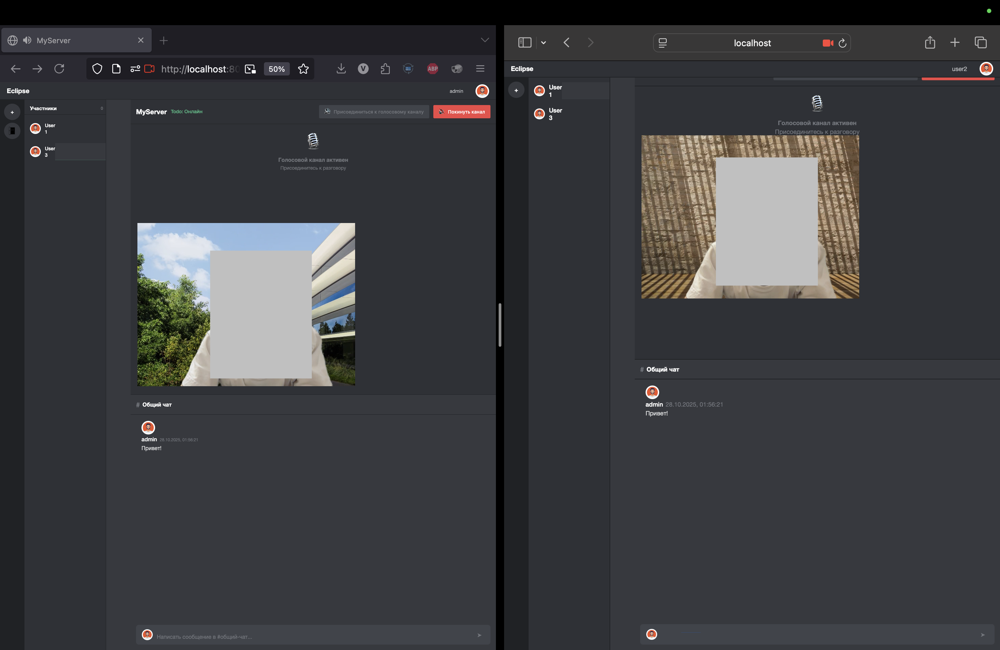

# Eclipse: Платформа коммуникаций в реальном времени / Real-Time Communication Platform

## Содержание / Table of Contents

- [Eclipse: Платформа коммуникаций в реальном времени / Real-Time Communication Platform](#eclipse-платформа-коммуникаций-в-реальном-времени--real-time-communication-platform)
  - [Содержание / Table of Contents](#содержание--table-of-contents)
  - [Русский](#русский)
    - [Eclipse: Платформа коммуникаций в реальном времени](#eclipse-платформа-коммуникаций-в-реальном-времени)
      - [Демонстрация](#демонстрация)
      - [Основные функции](#основные-функции)
      - [Технологический стек](#технологический-стек)
      - [Начало работы](#начало-работы)
      - [Архитектура проекта](#архитектура-проекта)
      - [Тестирование](#тестирование)
      - [Лицензия](#лицензия)
  - [English](#english)
    - [Eclipse: Real-Time Communication Platform](#eclipse-real-time-communication-platform)
      - [Demo](#demo)
      - [Key Features](#key-features)
      - [Tech Stack & Tools](#tech-stack--tools)
      - [Getting Started](#getting-started)
      - [Project Architecture](#project-architecture)
      - [Testing](#testing)
      - [License](#license)

---

## Русский

### Eclipse: Платформа коммуникаций в реальном времени

[](https://www.python.org/)
[](https://www.djangoproject.com/)
[](https://www.django-rest-framework.org/)
[](https://channels.readthedocs.io/)
[](https://www.postgresql.org/)
[](https://redis.io/)
[](https://webrtc.org/)

**Eclipse** — это мощная платформа чата и голосовой связи в реальном времени, вдохновленная современными социальными платформами. Она построена с масштабируемой архитектурой бэкенда с использованием Django и Django Channels, разработана для эффективной обработки асинхронных коммуникаций.

#### Демонстрация

Вот демонстрация чата в реальном времени и видеосвязи в действии:



---

#### Основные функции

- **Коммуникация через WebSocket в реальном времени**: Использование Django Channels и слоя каналов Redis для мгновенных сообщений и индикаторов присутствия в чат-серверах.
- **RESTful API**: Хорошо определенный API, построенный с помощью Django REST Framework для управления пользователями и получения данных.
- **Асинхронная архитектура**: Построена на ASGI-совместимой установке с Daphne для обработки большого количества одновременных соединений для чата и сигнализации.
- **Аутентификация и управление пользователями**: Полная система регистрации, входа и управления профилем пользователей, включая загрузку аватаров.
- **Управление серверами и каналами**: Функциональность для создания, подключения и управления собственными серверами и каналами связи.
- **WebRTC сигнализация**: Поддержка бэкенда для голосовой связи peer-to-peer.
- **Поддержка текстового и голосового чата**: Возможности реального времени для обмена сообщениями и голосовыми каналами.
- **Управление комнатами**: Создание, присоединение и модерация комнат с различными типами каналов (текстовыми и голосовыми).
- **Модерация и роли пользователей**: Три основные роли - создатель, модератор, пользователь - с соответствующими действиями.
- **Демонстрация экрана**: Возможность делиться экраном с другими участниками комнаты.
- **Видеочат**: Поддержка видеосвязи в реальном времени в дополнение к аудиосвязи.
- **Статусы пользователей**: Индикация статуса (в сети, неактивен, не беспокоить).
- **Сохранение истории сообщений**: Хранение сообщений в базе данных с поддержкой пагинации.

---

#### Технологический стек

- **Бэкенд**: Python, Django, Django REST Framework, Django Channels, Daphne, Gunicorn
- **База данных**: PostgreSQL (для продакшена), SQLite3 (для разработки)
- **Кэш и брокер сообщений**: Redis
- **Фронтенд**: HTML5, CSS3, JavaScript, WebRTC, WebSocket
- **Инфраструктура**: Docker, Docker Compose, Nginx

---

#### Начало работы

Чтобы запустить проект на вашей локальной машине, вам понадобится только Python и Redis.

**Предварительные требования**:
- Python 3.11+
- Redis
- Docker и Docker Compose (рекомендуется)

**Инструкции**:
1. Клонируйте репозиторий и перейдите в него:
   ```sh
   git clone https://github.com/cuwuvaa/Eclipse.git
   cd Eclipse
   ```
2. Запустите проект с помощью Docker Compose:
   ```sh
   docker-compose up --build
   ```
   Или, если вы хотите запустить приложение локально:
3. Создайте и активируйте виртуальное окружение:
   ```sh
   python -m venv venv
   source venv/bin/activate  # На Windows: venv\Scripts\activate
   ```
4. Установите необходимые зависимости:
   ```sh
   pip install -r requirements.txt
   ```
5. Примените миграции базы данных:
   ```sh
   python manage.py migrate
   ```
6. Запустите сервер разработки:
   ```sh
   python manage.py runserver
   ```
Приложение будет доступно по адресу `http://localhost:1337`.

---

#### Архитектура проекта

Проект разделен на следующие основные приложения Django:

- **EclipseUser**: Модель пользователя, аутентификация и профили
- **EclipseRoom**: Модели комнат, пользователей комнаты и сообщений
- **api**: REST API для взаимодействия с бэкендом
- **Основное приложение Eclipse**: Настройки Django, URL-маршруты, шаблоны

Клиентская часть реализована с помощью JavaScript и WebSocket для реального времени, а также WebRTC для голосовой/видеосвязи.

---

#### Тестирование

Проект включает комплексный набор тестов для обеспечения качества кода и правильной работы всех компонентов:

- **Модульные тесты**: Проверка корректности создания пользователей, комнат и сообщений
- **Тесты представлений**: Проверка функциональности аутентификации, профилей, комнат и API
- **Тесты API**: Проверка корректности работы REST API
- **Тесты разрешений**: Проверка корректности работы системы ролей и разрешений

Для запуска тестов выполните:
```bash
# В Docker контейнере
docker exec eclipse-web-1 coverage run manage.py test --pattern="test_*.py" && docker exec eclipse-web-1 coverage report

# Локально
coverage run manage.py test --pattern="test_*.py" && coverage report
```

---

#### Лицензия

Распространяется под лицензией MIT. См. файл `LICENSE` для получения дополнительной информации.

---

## English

### Eclipse: Real-Time Communication Platform

[](https://www.python.org/)
[](https://www.djangoproject.com/)
[](https://www.django-rest-framework.org/)
[](https://channels.readthedocs.io/)
[](https://www.postgresql.org/)
[](https://redis.io/)
[](https://webrtc.org/)

**Eclipse** is a robust, real-time chat and voice communication platform inspired by modern social platforms. It is built with a scalable backend architecture using Django and Django Channels, designed to handle asynchronous communication efficiently.

#### Demo

Here is a demonstration of the real-time chat and video connection in action:


---

#### Key Features

- **Real-time WebSocket Communication**: Utilizes Django Channels and a Redis channel layer for instant messaging and presence indicators in chat servers.
- **RESTful API**: A well-defined API built with Django REST Framework for user management and data retrieval.
- **Asynchronous Architecture**: Built on an ASGI-compliant setup with Daphne to handle a high number of concurrent connections for chat and signaling.
- **User Authentication & Management**: A complete system for user registration, login, and profile management, including avatar uploads.
- **Server & Channel Management**: Functionality for users to create, join, and manage their own communication servers and channels.
- **WebRTC Signaling**: Backend support for peer-to-peer voice communication channels.
- **Text and Voice Chat Support**: Real-time capabilities for both messaging and voice channels.
- **Room Management**: Create, join, and moderate rooms with different channel types (text and voice).
- **Moderation and User Roles**: Three main roles - creator, moderator, user - with appropriate actions.
- **Screen Sharing**: Ability to share your screen with other room participants.
- **Video Chat**: Video chat support in addition to audio chat.
- **User Statuses**: Status indicators (online, idle, do not disturb).
- **Message History**: Message storage in the database with pagination support.

---

#### Tech Stack & Tools

- **Backend**: Python, Django, Django REST Framework, Django Channels, Daphne, Gunicorn
- **Database**: PostgreSQL (production), SQLite3 (development)
- **Cache & Message Broker**: Redis
- **Frontend**: HTML5, CSS3, JavaScript, WebRTC, WebSocket
- **Infrastructure**: Docker, Docker Compose, Nginx

---

#### Getting Started

To get the project up and running on your local machine, you only need Python and Redis.

**Prerequisites**:
- Python 3.11+
- Redis
- Docker and Docker Compose (recommended)

**Instructions**:
1. Clone the repository and navigate into it:
   ```sh
   git clone https://github.com/cuwuvaa/Eclipse.git
   cd Eclipse
   ```
2. Run the project using Docker Compose:
   ```sh
   docker-compose up --build
   ```
   Or, if you prefer to run the application locally:
3. Create and activate a virtual environment:
   ```sh
   python -m venv venv
   source venv/bin/activate  # On Windows: venv\Scripts\activate
   ```
4. Install the required dependencies:
   ```sh
   pip install -r requirements.txt
   ```
5. Apply the database migrations:
   ```sh
   python manage.py migrate
   ```
6. Run the development server:
   ```sh
   python manage.py runserver
   ```
The application will be available at `http://localhost:8000`.

---

#### Project Architecture

The project is divided into the following main Django applications:

- **EclipseUser**: User model, authentication, and profiles
- **EclipseRoom**: Room, room user, and message models
- **api**: REST API for backend communication
- **Main Eclipse app**: Django settings, URL routing, templates

The frontend is implemented with JavaScript and WebSocket for real-time communication, along with WebRTC for voice/video chat.

---

#### Testing

The project includes a comprehensive test suite to ensure code quality and correct functioning of all components:

- **Model Tests**: Verification of proper user, room, and message creation
- **View Tests**: Verification of authentication, profile, room, and API functionality
- **API Tests**: Verification of REST API correctness
- **Permission Tests**: Verification of role and permission system functionality

To run the tests:
```bash
# In Docker container
docker exec eclipse-web-1 coverage run manage.py test --pattern="test_*.py" && docker exec eclipse-web-1 coverage report

# Locally
coverage run manage.py test --pattern="test_*.py" && coverage report
```

---

#### License

Distributed under the MIT License. See `LICENSE` for more information.