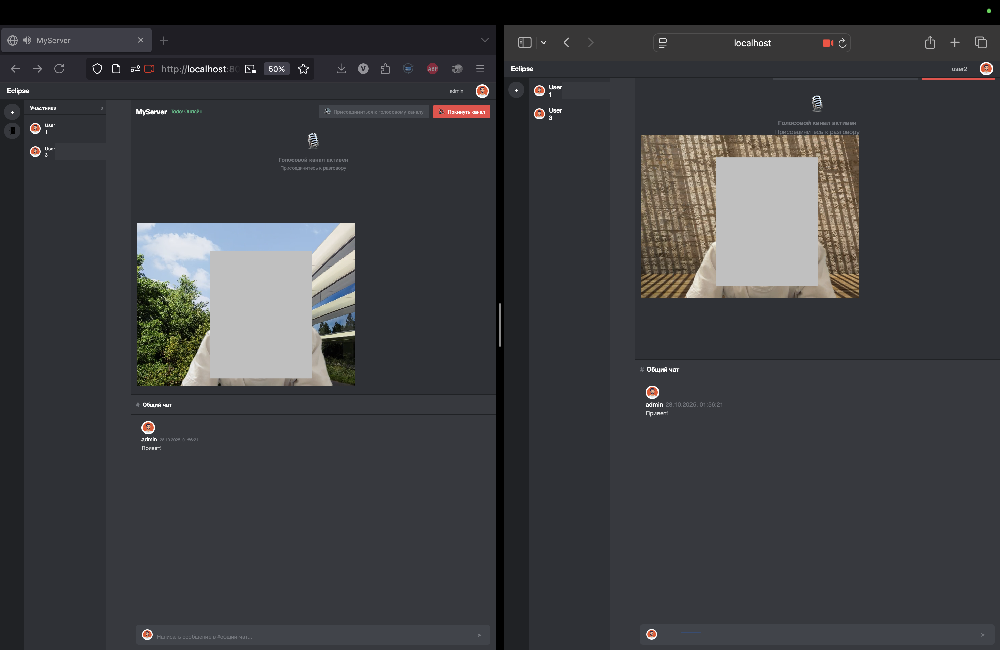

# Eclipse: Real-Time Communication Platform

[](https://www.python.org/)
[](https://www.djangoproject.com/)
[](https://www.django-rest-framework.org/)
[](https://channels.readthedocs.io/)
[](https://www.postgresql.org/)
[](https://redis.io/)
[](https://webrtc.org/)

**Eclipse** is a robust, real-time chat and voice communication platform inspired by modern social platforms. It is built with a scalable backend architecture using Django and Django Channels, designed to handle asynchronous communication efficiently.

### Demo

Here is a demonstration of the real-time chat and video connection in action:



---

### Key Backend Features

- **Real-time WebSocket Communication**: Utilizes Django Channels and a Redis channel layer for instant messaging and presence indicators in chat servers.
- **RESTful API**: A well-defined API built with Django REST Framework for user management and data retrieval.
- **Asynchronous Architecture**: Built on an ASGI-compliant setup with Daphne to handle a high number of concurrent connections for chat and signaling.
- **User Authentication & Management**: A complete system for user registration, login, and profile management, including avatar uploads.
- **Server & Channel Management**: Functionality for users to create, join, and manage their own communication servers and channels.
- **WebRTC Signaling**: Backend support for peer-to-peer voice communication channels.

---

### Tech Stack & Tools

- **Backend**: Python, Django, Django REST Framework, Django Channels, Daphne, Gunicorn
- **Database**: PostgreSQL (production-ready), SQLite3 (development)
- **Cache & Message Broker**: Redis
- **Frontend**: HTML5, CSS3, JavaScript, WebRTC

---

### API Endpoints

The following are the core API endpoints available.

| Endpoint          | Method | Description                  |
| ----------------- | ------ | ---------------------------- |
| `/api/user/{id}/` | `GET`  | Retrieves public data for a specific user. |
| *...more to come* |        |                              |

---

### Getting Started

To get the project up and running on your local machine, you only need Python and Redis.

**Prerequisites**:
- Python 3.11+
- Redis

**Instructions**:
1. Clone the repository and navigate into it:
   ```sh
   git clone https://github.com/cuwuvaa/Eclipse.git
   cd Eclipse
   ```
2. Create and activate a virtual environment:
   ```sh
   python -m venv venv
   source venv/bin/activate
   ```
3. Install the required dependencies:
   ```sh
   pip install -r requirements.txt
   ```
4. Apply the database migrations:
   ```sh
   python manage.py migrate
   ```
5. Run the development server:
   ```sh
   python manage.py runserver
   ```
The application will be available at `http://localhost:8000`.

---

### License

Distributed under the MIT License. See `LICENSE` for more information.